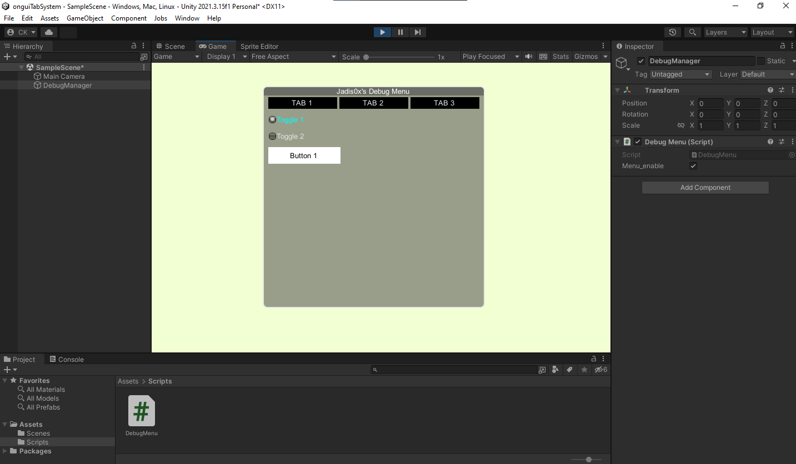

This project contains a simple example of a tabbed user interface (UI) created using Unity's OnGUI method.

## Features
- Ability to switch between multiple tabs
- Display different content in each tab

## Contact
Discord: jadis0x
